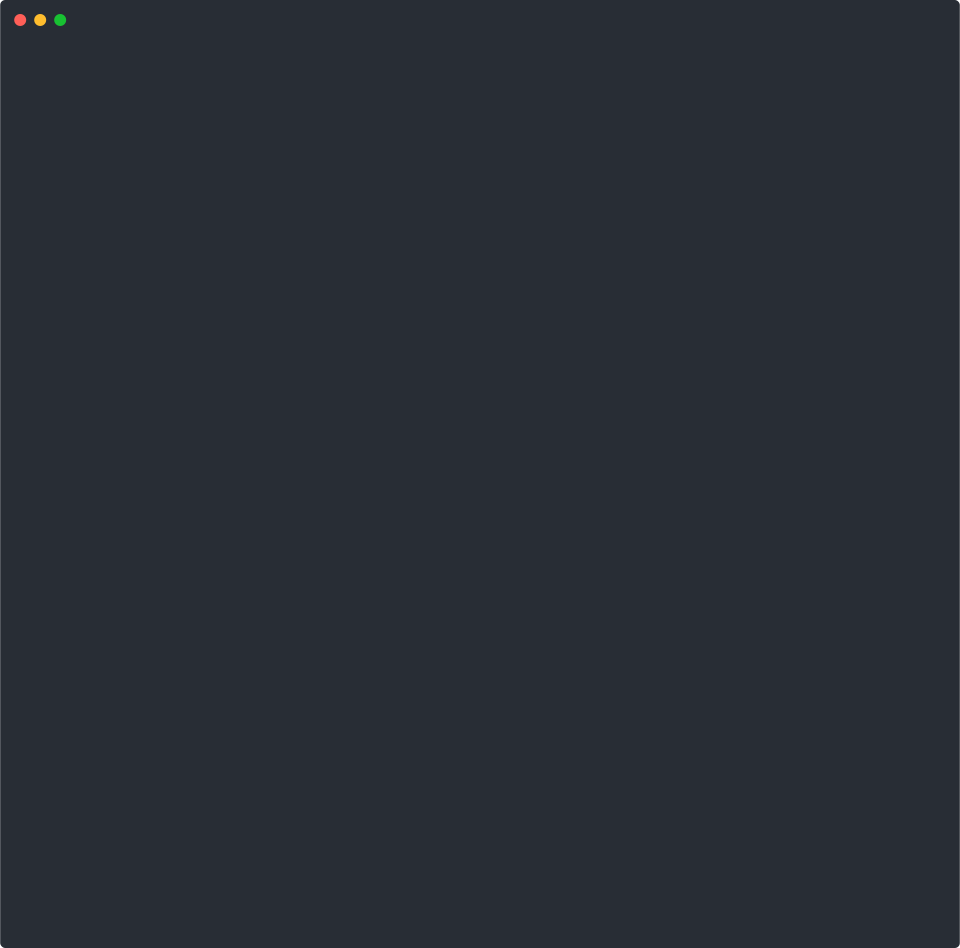

# Awesome Bitcoin Internals

<div align="center">


**A curated guide to understanding Bitcoin from first principles — with a hands-on Rust implementation you can run, read, and hack on.**

[](https://awesome.re)
[](https://www.rust-lang.org/)
[](./LICENSE)
[](https://github.com/GeoffreyWang1117/SimpleBTC/actions)
[]()

[Learning Path](#-learning-path) | [Resources](#-resources) | [Hands-on Implementation](#-hands-on-simplebtc) | [Quick Start](#-quick-start) | [中文](#中文说明)

</div>

<div align="center">

</div>

---

> _"The best way to understand Bitcoin is to build it."_

This repo has two parts:

1. **A curated reading list** — papers, books, courses, and tools from foundations to mastery
2. **A complete Bitcoin implementation in Rust** (SimpleBTC) — 7,900+ lines of production-quality code you can run locally with a Web UI

---

## Contents

- [Learning Path](#-learning-path)
- [Resources](#-resources)
  - [Foundational Papers](#foundational-papers)
  - [Books](#books)
  - [Video Courses](#video-courses)
  - [Protocol Deep Dives](#protocol-deep-dives)
  - [Build Your Own Blockchain](#build-your-own-blockchain)
  - [Cryptographic References](#cryptographic-references)
  - [Developer Tools](#developer-tools)
  - [Other Awesome Lists](#other-awesome-lists)
- [Hands-on: SimpleBTC](#-hands-on-simplebtc)
- [Quick Start](#-quick-start)

---

## Learning Path

| Phase | Focus | What to Read / Do |
|-------|-------|-------------------|
| **1. Why Bitcoin?** | Big picture | [3Blue1Brown video](https://www.youtube.com/watch?v=bBC-nXj3Ng4), [Nakamoto whitepaper](https://bitcoin.org/bitcoin.pdf) |
| **2. How Bitcoin works** | Protocol fundamentals | [Mastering Bitcoin](https://github.com/bitcoinbook/bitcoinbook) Ch. 1-6, [learnmeabitcoin.com](https://learnmeabitcoin.com/) |
| **3. Build it yourself** | Code-level understanding | [Programming Bitcoin](https://github.com/jimmysong/programmingbitcoin) (Python) or **SimpleBTC** (Rust, this repo) |
| **4. Go deeper** | Consensus, Script, crypto | [Chaincode Labs curriculum](https://github.com/chaincodelabs/bitcoin-curriculum), [Bitcoin Optech](https://bitcoinops.org/) |
| **5. Contribute** | Open source | [Bitcoin Core](https://github.com/bitcoin/bitcoin), [BIPs](https://github.com/bitcoin/bips), [Chaincode BOSS](https://learning.chaincode.com/) |

---

## Resources

### Foundational Papers

| Paper | Authors | Year | Why It Matters |
|-------|---------|------|---------------|
| [Bitcoin: A Peer-to-Peer Electronic Cash System](https://bitcoin.org/bitcoin.pdf) | Satoshi Nakamoto | 2008 | The 9-page paper that started it all |
| [The Byzantine Generals Problem](https://lamport.azurewebsites.net/pubs/byz.pdf) | Lamport, Shostak, Pease | 1982 | Seminal allegory for consensus with faulty actors |
| [A Certified Digital Signature](http://www.ralphmerkle.com/papers/Certified1979.pdf) | Ralph Merkle | 1979 | Introduces hash trees (Merkle trees) |
| [Practical Byzantine Fault Tolerance](https://pmg.csail.mit.edu/papers/osdi99.pdf) | Castro & Liskov | 1999 | Efficient BFT consensus — foundational for PoS chains |
| [Hashcash - A Denial of Service Counter-Measure](http://www.hashcash.org/papers/hashcash.pdf) | Adam Back | 2002 | Proof-of-work precursor cited by Nakamoto |

### Books

| Book | Author | Level | Notes |
|------|--------|-------|-------|
| [Mastering Bitcoin, 3rd Ed.](https://github.com/bitcoinbook/bitcoinbook) | Andreas Antonopoulos & David Harding | Beginner-Advanced | Free on GitHub. The definitive technical intro — covers keys, UTXO, Script, SegWit, Taproot |
| [Programming Bitcoin](https://github.com/jimmysong/programmingbitcoin) | Jimmy Song | Intermediate | Build a Bitcoin library from scratch in Python. Elliptic curve math to networking |
| [Bitcoin and Cryptocurrency Technologies](https://bitcoinbook.cs.princeton.edu/) | Narayanan et al. | Beginner | Princeton textbook. Companion to the Coursera course |
| [Grokking Bitcoin](https://rosenbaum.se/book/) | Kalle Rosenbaum | Beginner | Visual, diagram-heavy approach to Bitcoin fundamentals |
| [Rust for Blockchain Application Development](https://www.amazon.com/Rust-Blockchain-Application-Development-decentralized/dp/1837634645) | Akhil Sharma | Intermediate | From Rust basics to building your own chain |

### Video Courses

- [But how does bitcoin actually work?](https://www.youtube.com/watch?v=bBC-nXj3Ng4) — 3Blue1Brown. Best single-video intro (26 min), visual and intuitive.
- [Bitcoin and Cryptocurrency Technologies](https://www.coursera.org/learn/cryptocurrency) — Princeton / Coursera. Free 11-week course.
- [Blockchain and Money (MIT 15.S12)](https://ocw.mit.edu/courses/15-s12-blockchain-and-money-fall-2018/) — Gary Gensler's MIT course with full lecture videos.
- [Cyfrin Updraft](https://updraft.cyfrin.io/courses) — Free beginner-to-advanced blockchain dev courses.

### Protocol Deep Dives

- [Learn Me A Bitcoin](https://learnmeabitcoin.com/) — Best free website for Bitcoin internals. Clear diagrams, real data, covers keys to Script to P2P.
- [Bitcoin Optech](https://bitcoinops.org/) — Weekly newsletter on Bitcoin/LN protocol development. The single best way to stay current.
- [Bitcoin Developer Reference](https://btcinformation.org/en/developer-reference) — Comprehensive reference for transactions, blocks, P2P, and RPC.
- [Bitcoin Wiki: Script](https://en.bitcoin.it/wiki/Script) — Complete reference for all opcodes and standard transaction types.
- [Bitcoin Improvement Proposals (BIPs)](https://github.com/bitcoin/bips) — The official spec repo. Key BIPs: 141 (SegWit), 340-342 (Schnorr/Taproot), 174 (PSBT).
- [River Learn: What Is Taproot?](https://river.com/learn/what-is-taproot/) — Clear explanation of P2TR, Schnorr, MAST.
- [River Learn: What Is SegWit?](https://river.com/learn/what-is-segwit/) — Witness separation, malleability fix, and how it enabled Lightning.

### Build Your Own Blockchain

| Tutorial | Language | Description |
|----------|----------|-------------|
| **SimpleBTC** (this repo) | Rust | Complete Bitcoin implementation — UTXO, PoW, Merkle/SPV, multisig, Script, Web UI |
| [Building Blockchain in Go](https://jeiwan.net/posts/building-blockchain-in-go-part-1/) | Go | Classic 7-part series. PoW, persistence, UTXO, addresses, P2P |
| [blockchain-from-scratch](https://github.com/JoshOrndorff/blockchain-from-scratch) | Rust | Tutorial repo with exercises |
| [How to Build a Blockchain in Rust](https://blog.logrocket.com/how-to-build-a-blockchain-in-rust/) | Rust | Mining, consensus, P2P in ~500 lines |
| [Programming Bitcoin](https://github.com/jimmysong/programmingbitcoin) | Python | Build a full Bitcoin library chapter by chapter |

### Cryptographic References

| Reference | What It Covers |
|-----------|---------------|
| [SEC 2: Recommended Elliptic Curve Domain Parameters](https://www.secg.org/sec2-v2.pdf) | Defines secp256k1 (Section 2.4.1) |
| [SEC 1: Elliptic Curve Cryptography](https://www.secg.org/sec1-v2.pdf) | ECDSA signing/verification algorithms |
| [Bitcoin Wiki: secp256k1](https://en.bitcoin.it/wiki/Secp256k1) | Curve parameters, implementations, performance |
| [Miniscript](https://bitcoin.sipa.be/miniscript/) | Structured language for composing Bitcoin Scripts |

### Developer Tools

- [btcdeb](https://github.com/bitcoin-core/btcdeb) — Step through Bitcoin Script execution op-by-op. Supports SegWit and Taproot.
- [Blockstream Explorer](https://blockstream.info/) — Open source explorer for mainnet, testnet, and Liquid.
- [Signet Explorer](https://explorer.bc-2.jp/) — Explorer for Bitcoin's Signet test network (BIP 325).
- [Signet Faucet](https://signet.bc-2.jp/) — Free sBTC for the stable Signet test network.
- [Jameson Lopp's Developer Tools](https://www.lopp.net/bitcoin-information/developer-tools.html) — Comprehensive list of libraries, APIs, and dev tools.

### Structured Curricula

- [Chaincode Labs — Bitcoin Protocol Development](https://github.com/chaincodelabs/bitcoin-curriculum) — Study guide for aspiring Bitcoin Core contributors.
- [Chaincode Labs — Bitcoin & Lightning Seminars](https://chaincode.gitbook.io/seminars/) — Weekly seminar topics with reading lists.
- [Chaincode BOSS Challenge](https://learning.chaincode.com/) — Month-long programming exercises for Bitcoin open source.

### Other Awesome Lists

- [awesome-bitcoin](https://github.com/igorbarinov/awesome-bitcoin) — Bitcoin services and tools for developers.
- [awesome-blockchain](https://github.com/yjjnls/awesome-blockchain) — Blockchain development resources.
- [awesome-blockchains](https://github.com/openblockchains/awesome-blockchains) — Open distributed databases with crypto hashes.

---

## Hands-on: SimpleBTC

This repo includes a **complete Bitcoin implementation in Rust** — not a toy demo, but a production-quality educational system with real cryptography.

### Why SimpleBTC?

Most "blockchain in X" tutorials stop at a toy chain with SHA256 hashing. SimpleBTC goes further:

- **Real Bitcoin cryptography** — secp256k1 ECDSA, not mock signatures
- **Complete UTXO model** — the way Bitcoin actually tracks balances
- **Advanced features** — multisig, RBF, timelocks, Script engine, SPV light client
- **Visual Web UI** — see blocks, transactions, and balances in your browser
- **Production-grade infra** — RocksDB storage, parallel mining, REST API, CI/CD

### Feature Map

```
Level 1: Foundations          Level 2: Transactions        Level 3: Advanced
┌─────────────────────┐     ┌─────────────────────┐     ┌─────────────────────┐
│ block.rs             │     │ transaction.rs       │     │ multisig.rs          │
│ blockchain.rs        │ --> │ wallet.rs            │ --> │ advanced_tx.rs       │
│ parallel_mining.rs   │     │ utxo.rs              │     │ script.rs            │
└─────────────────────┘     │ crypto.rs            │     │ spv.rs               │
  Blocks, PoW, chains        └─────────────────────┘     │ mempool.rs           │
                               UTXO, signing, keys        └─────────────────────┘
                                                            Multisig, RBF, SPV
```

### Bitcoin Feature Comparison

| Feature | SimpleBTC | Real Bitcoin |
|---------|-----------|-------------|
| UTXO Model | Yes | Yes |
| Proof of Work (SHA256) | Yes | Yes (Double SHA256) |
| Merkle Trees + SPV | Yes | Yes |
| Multi-Signature (M-of-N) | Yes | Yes (P2SH/P2WSH) |
| Replace-By-Fee | Yes (BIP125) | Yes (BIP125) |
| TimeLock | Yes | Yes (CLTV/CSV) |
| ECDSA Signatures | Yes (secp256k1) | Yes (secp256k1/Schnorr) |
| Script System | Simplified | Full Script |
| P2P Network | Simulated | Distributed |

### Architecture

```
src/
├── Core Blockchain
│   ├── block.rs            # Block structure, PoW
│   ├── blockchain.rs       # Chain logic, validation
│   ├── transaction.rs      # TX inputs/outputs, UTXO
│   ├── wallet.rs           # Key management, addresses
│   ├── utxo.rs             # UTXO set tracking
│   └── crypto.rs           # Real secp256k1 ECDSA
├── Advanced Features
│   ├── merkle.rs           # Merkle tree + SPV proofs
│   ├── multisig.rs         # M-of-N multi-signature
│   ├── advanced_tx.rs      # RBF + TimeLock
│   ├── mempool.rs          # Transaction pool
│   ├── script.rs           # Bitcoin Script engine
│   ├── spv.rs              # SPV light client
│   └── parallel_mining.rs  # Multi-threaded PoW
├── Infrastructure
│   ├── storage.rs          # RocksDB persistence
│   ├── network.rs          # P2P protocol
│   ├── security.rs         # Validation rules
│   └── ...                 # config, logging, indexer, error
├── bin/server.rs           # REST API + Web UI
└── bin/node.rs             # P2P network node

examples/
├── enterprise_multisig.rs  # Corporate 2-of-3 multisig
├── escrow_service.rs       # Trustless escrow
└── timelock_savings.rs     # Time-locked savings
```

---

## Quick Start

```bash
git clone https://github.com/GeoffreyWang1117/SimpleBTC.git
cd SimpleBTC
cargo run --bin btc-server --release
```

Open **http://localhost:3000** — click **"Run Demo"** to see mining, transactions, and balance updates.

### CLI Demo

```bash
cargo run --bin btc-demo --release
```

### REST API

```bash
curl -X POST http://localhost:3000/api/wallet/create
curl http://localhost:3000/api/wallet/balance/ADDRESS
curl -X POST http://localhost:3000/api/transaction/create \
  -H "Content-Type: application/json" \
  -d '{"from_address":"ADDR1","to_address":"ADDR2","amount":50,"fee":5}'
curl -X POST http://localhost:3000/api/mine \
  -H "Content-Type: application/json" \
  -d '{"miner_address":"ADDRESS"}'
```

### Examples

```bash
cargo run --example enterprise_multisig   # Corporate 2-of-3 multisig
cargo run --example escrow_service        # Trustless escrow
cargo run --example timelock_savings      # Time-locked savings
```

### Development

```bash
cargo test                                     # 101 tests
cargo bench                                    # Performance benchmarks
cargo clippy --all-targets --all-features      # Lint (0 warnings)
cd docs && mdbook serve --open                 # Browse documentation
```

---

## Contributing

Contributions welcome! Some areas where help is needed:

- **P2P networking layer** — real TCP/UDP node communication
- **SegWit support** — witness data segregation
- **Lightning Network** — Layer 2 payment channels
- **More Script opcodes** — expand the script engine
- **More resources** — know a great paper or tutorial? Open a PR!

See [CONTRIBUTING](./docs/src/appendix/contributing.md) for guidelines.

## License

[MIT](./LICENSE)

---

## 中文说明

本仓库包含两部分：

1. **精选学习资源清单** — 从零开始学习比特币内部原理的论文、书籍、课程和工具
2. **完整的 Rust 比特币实现 (SimpleBTC)** — 7,900+ 行代码，配有 Web UI，可本地运行

### 核心特性

- **UTXO模型** — 比特币原生的未花费交易输出模型，防双花
- **工作量证明** — SHA256挖矿，可配置难度
- **Merkle树** — 高效交易验证，支持SPV证明
- **多重签名** — M-of-N多签钱包（企业级安全）
- **RBF** — BIP125交易替换（加速确认）
- **时间锁** — 基于时间/区块高度的锁定
- **Bitcoin脚本** — 脚本执行引擎
- **SPV轻客户端** — 简化支付验证
- **内存池** — 手续费优先级排序的交易池
- **真实密码学** — secp256k1 ECDSA签名
- **Web界面** — 内置浏览器界面，无需额外依赖

### 快速开始

```bash
git clone https://github.com/GeoffreyWang1117/SimpleBTC.git
cd SimpleBTC
cargo run --bin btc-server --release
# 打开浏览器访问 http://localhost:3000
```

### 学习路径

1. **入门**: 运行 `btc-demo`，阅读 `docs/src/guide/` 目录
2. **进阶**: 学习高级特性（多签、RBF、TimeLock），研究 `examples/`
3. **深入**: 阅读核心源码 `blockchain.rs`、`transaction.rs`、`block.rs`

### 完整文档

```bash
cargo install mdbook
cd docs && mdbook serve --open
```

15,000+ 字系统化中文文档，涵盖从入门到精通的所有内容。

---

<div align="center">

**Awesome Bitcoin Internals** — Learn Bitcoin by building it.

If this helped you, a star means a lot.

</div>
